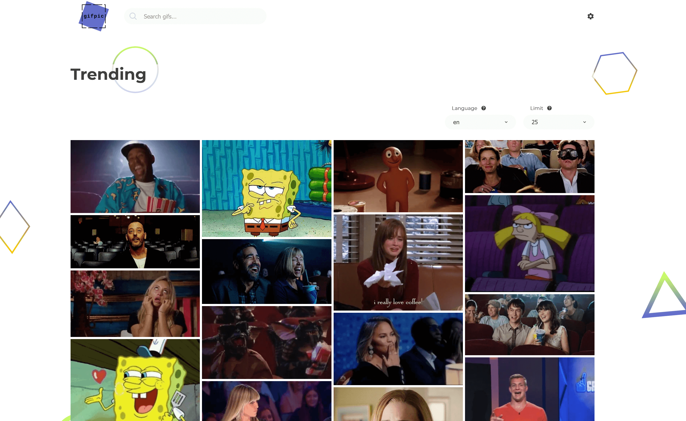

# Gifpic - giphy browser

https://gif-pic.web.app



## Table of contents

- [Instructions](#Instructions)
- [Description](#Description)
- [Technologies](#Technologies)

## Instructions

First clone this repository.

```bash
$ git clone https://github.com/rawfour/gifpic.git
```

Install dependencies. Make sure you already have [`nodejs`](https://nodejs.org/en/) & [`npm`](https://www.npmjs.com/) installed in your system.

```bash
$ npm install # or yarn
```

Paste your Giphy api key to .env file.

```
REACT_APP_API_KEY={your_giphy_api_key_here}
```

Run it

```bash
$ npm start # or yarn start
```

## Description

Application for searching gifs by keywords.

## Technologies

Project uses:

- React + React Hooks
- Redux
- React Router
- Styled Component
- MaterialUi
- Tools: ESlint, Husky + lint-staged, Storybook
